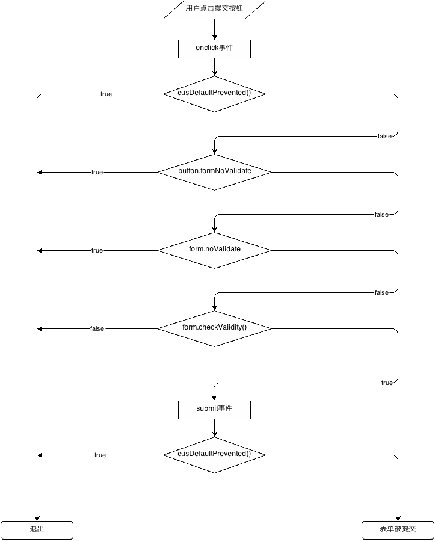
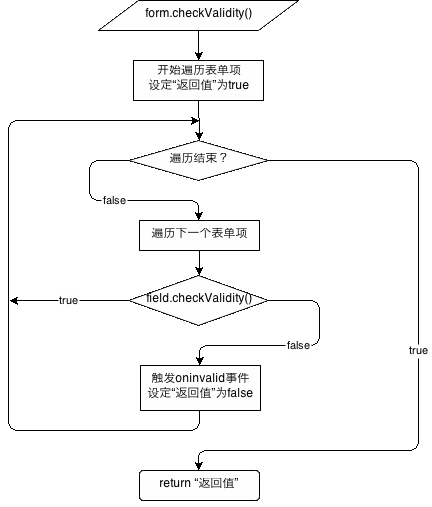

html5 表单验证业务逻辑
======

这两个流程图并非只针对本项目，它们是浏览器原生的表单验证逻辑的流程，h5form与其保持了一致

----------

## 表单验证基本逻辑

** 如果调用`form.submit()`逻辑将从图上“submit事件”处开始向下执行 **

## `form.checkValidity()`函数逻辑

## 错误报告编写建议

加载jQuery时，h5form会将原生oninvalid事件干掉，使用jquery重新模拟，所以建议再在document除监听oninvalid事件，然后弹出错误提示信息即可。如果要添加不报告错误的例外机制，可在弹出错误提示前检查事件对象的event.isDefaultPrevented()

## 编辑流程图

- 流程图使用[https://www.draw.io/在线编辑](https://www.draw.io/)
- 源代码为此目录下的xml文件